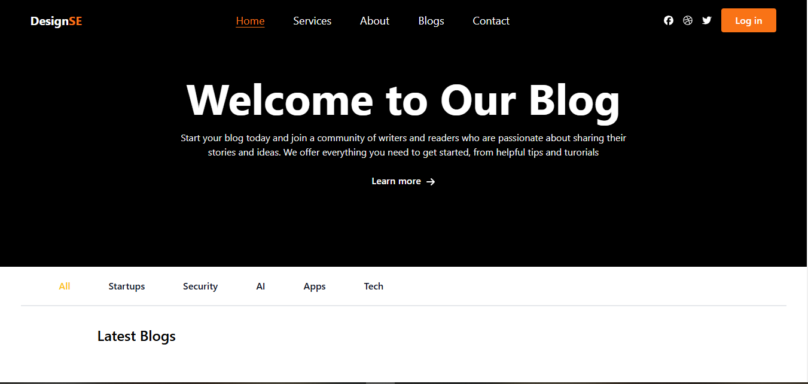

# Blog Website

This project is a blog website created using React.js for the front end and a Node.js API for backend data fetching. The Node.js API serves as a simple endpoint to retrieve blog posts, while the React front end displays them to users.

## Features

- **Frontend (React.js)**:
  - Home page displaying a list of blog posts.
  - Individual blog post pages with detailed content.
  - Responsive design with clean and simple navigation.
  
- **Backend (Node.js API)**:
  - Provides data for blog posts via API endpoints.
  - Serves static data or pulls from a connected database.
  - Handles basic requests to retrieve blog post data.

## Technologies Used

- **Frontend**:
  - React.js - For building the user interface and managing component structure.
  - CSS - For styling and responsive layout.

- **Backend**:
  - Node.js and Express - For creating a simple API to serve blog post data.
  - MongoDB or JSON  - For storing blog post data if a database is connected.

